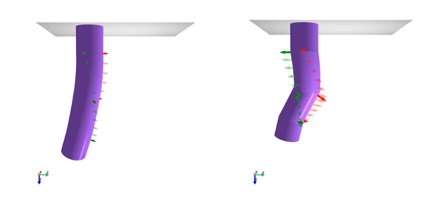

# Selective Piecewise Constant Strain Kinematics

This repository provides a JAX implementation of the Selective Piecewise Constant Strain (SPCS) kinematics for continuum 
soft robots. SPCS combines Constant Strain (CS) and Piecewise Constant Strain (PCS) [[1]](#1) kinematics to allow for some strains
to stay constant throughout the entire robot, while other strains vary piecewise.
This allows us to minimize the degrees of freedom of the kinematic state while still being able to accurately model the
shape of the robot.

As we show in our paper (see below), SPCS is for example a good choice for robots based on Handed Shearing Auxetics (HSAs).
The twist and axial strains of the HSAs can be kept constant throughout the robot, while the bending and shear strains 
vary piecewise.

We provide an efficient implementation in JAX for evaluating the 3D forward kinematics of many points along the 
centerline of the robot.
We make use of the JAX autograd capabilities to implement a differential inverse kinematics algorithm that can be
for example used for shape sensing purposes.



## Citation
This kinematic model is part of the publication **Modelling Handed Shearing Auxetics:
Selective Piecewise Constant Strain Kinematics and Dynamic Simulation** presented at the 
_6th IEEE-RAS International Conference on Soft Robotics (RoboSoft 2023)_. 
You can find the publication online on ~~IEEE Xplore~~.

Please use the following citation if you use our method in your (scientific) work:

```bibtex
@inproceedings{stolzle2023modelling,
  title={Modelling Handed Shearing Auxetics: Selective Piecewise Constant Strain Kinematics and Dynamic Simulation},
  author={St{\"o}lzle, Maximilian and Chin, Lillian and Truby, Ryan L. and Rus, Daniela and Della Santina, Cosimo},
  booktitle={2023 IEEE 6th International Conference on Soft Robotics (RoboSoft)},
  year={2023},
  organization={IEEE}
}
```

## Installation
The plugin can be installed from PyPI:

```bash
pip install jax-spcs-kinematics
```

or locally from the source code:

```bash
pip install .
```

## Getting started

We invite you to run the example script to demonstrate both the forward and inverse kinematics capabilities of the SPCS model:

```bash
python examples/spcs_example.py
```

## Usage

Below, you can find a minimal example of how to use the SPCS kinematic model.

### Initialization

We start with the initialization of the model:

```python
from jax import numpy as jnp
from spcs_kinematics.kinematic_parametrizations import SelectivePiecewiseConstantStrain

kinematics = SelectivePiecewiseConstantStrain(
    # specify the original length of each segment
    # in this case, the rod is composed of 2 segments of length 0.5 m each
    l0=jnp.array([0.5, 0.5]),
    # model twist and elongation to be constant across entire rod
    strain_selector_cs=jnp.array([False, False, True, False, False, True]),
    # model the bending and shear strains to be constant across each segment 
    # (i.e. piecewise constant)
    strain_selector_pcs=jnp.array([True, True, False, True, True, False])
)
```

The strain basis of the CS and PCS can then be verified:

```python
print(kinematics.strain_basis_cs)
print(kinematics.strain_basis_pcs)
```

which should result in:

```math
\begin{split}
    B_\mathrm{CS} = \begin{bmatrix}
        0 & 0 & 1 & 0 & 0 & 0\\
        0 & 0 & 0 & 0 & 0 & 1\\
    \end{bmatrix}^\mathrm{T} \in \mathbb{R}^{6 \times 2},\\
    B_{\mathrm{PCS},i} = \begin{bmatrix}
        1 & 0 & 0 & 0 & 0 & 0\\
        0 & 1 & 0 & 0 & 0 & 0\\
        0 & 0 & 0 & 1 & 0 & 0\\
        0 & 0 & 0 & 0 & 1 & 0\\
    \end{bmatrix}^\mathrm{T} \in \mathbb{R}^{6 \times 4}.
\end{split}
```

### Forward kinematics

The configuration vector is then defined as:

```math
q = \begin{pmatrix}
    \phi_0 & 
    \kappa_z & \sigma_z & 
    \kappa_{x,1} & \kappa_{y,1} & \sigma_{y,1} & \sigma_{y,1} &
    \kappa_{x,2} & \kappa_{y,2} & \sigma_{y,2} & \sigma_{y,2}
\end{pmatrix}^\mathrm{T} \in \mathbb{R}^{11}
```

or expressed in words the twist angle $\phi_0$ followed by the constant twist and axial strains $\kappa_z$ and $\sigma_z$.
The bending and shear strains are then defined for each segment, 
i.e. $\kappa_{x,1}$, $\kappa_{y,1}$, $\sigma_{y,1}$, $\sigma_{y,1}$ for the first segment and $\kappa_{x,2}$, $\kappa_{y,2}$, $\sigma_{y,2}$, $\sigma_{y,2}$ for the second segment.

Next, we define an example configuration vector and evaluate the forward kinematics at the points 0.5m and 1.0m 
along the centerline of the rod:

```python
# configuration vector
# corresponds to a rod with a twist angle of 20 degrees at the base, 
# a constant twist strain of 20 deg, axial strain of 0.1, 
# bending around x-axis of 90 degrees for the first segment 
# and 90 degrees around the y-axis for the second segment. 
# All other strains are zero.
q = jnp.array([
    20 / 180 * jnp.pi,  # phi_0 
    jnp.pi, 0.1,  # kappa_z, sigma_z
    90 / 180 * jnp.pi & 0 & 0 & 0 &  # kappa_x_1, kappa_y_1, sigma_x_1, sigma_y_1
    0 & 90 / 180 * jnp.pi & 0 & 0  # kappa_x_2, kappa_y_2, sigma_x_2, sigma_y_2
])

# point coordinates
s = jnp.array([0.5, 1.0])

# evaluate forward kinematics
# will return the SE(3) transformation matrix for each point along the centerline of the rod
# T will have shape (4, 4, 2)
T = kinematics.forward_kinematics(s, q)
```

### Inverse kinematics

With the same object of the kinematics class, we can also run a differential inverse kinematics optimization to find the 
configuration vector that corresponds to a given SE(3) transformation matrix:

```python
# initial guess for the configuration vector
q_init = jnp.zeros_like(q)

# step size / learning rate for the gradient descent
GAMMA = 2e-1 * jnp.ones(q.shape)

q_hat, e_chi, q_its, e_chi_its = kinematics.inverse_kinematics(
    T,  # target transformation matrices
    s,  # point coordinates
    num_iterations=1000,  # number of iterations
    state_init=q_init,  # initial guess for the configuration vector
    translational_error_weight=1e0,  # weight for the translational error
    rotational_error_weight=1e0,  # weight for the rotational error
    gamma=GAMMA,  # step size / learning rate for the gradient descent
)
```

## See also

You might also be interested in the following repositories:

 - You can find code and datasets used for the verification of the SPCS model for HSA robots in the 
[`hsa-kinematic-model`](https://github.com/tud-cor-sr/hsa-kinematic-model) repository.
 - The [`HSA-PyElastica`](https://github.com/tud-cor-sr/HSA-PyElastica) repository contains a plugin for PyElastica
for the simulation of HSA robots.

## References
<a id="1">[1]</a> Renda, Federico, et al. "Discrete cosserat approach for multisection soft manipulator dynamics." 
IEEE Transactions on Robotics 34.6 (2018): 1518-1533.
